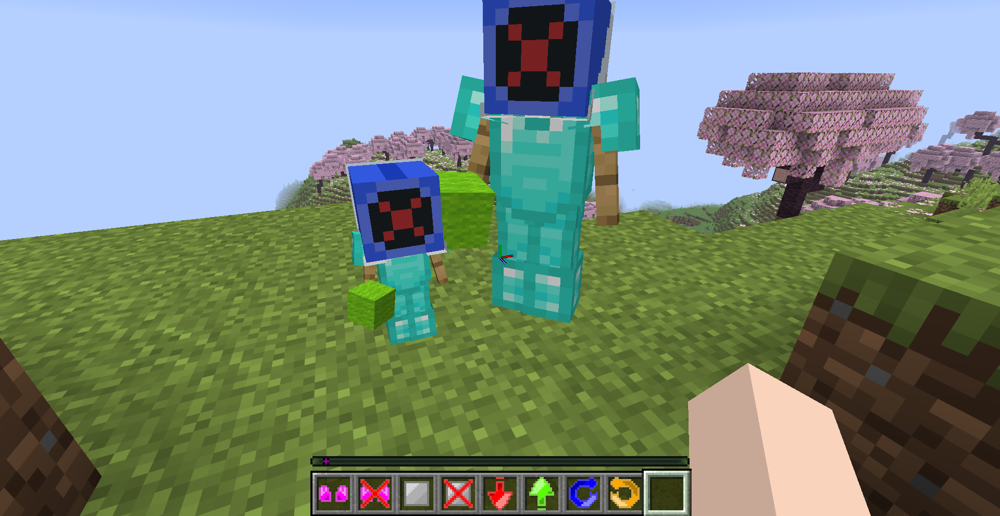
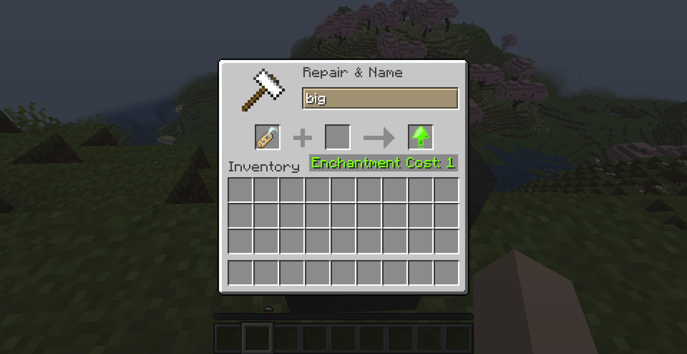

# ASU Companion Resource Pack

This is an **optional** Resource Pack designed to be used with [Armor Stand Utils](https://modrinth.com/datapack/armor-stand-utils) that **retextures** the Name Tags **depending on their name** to make them easier to distinguish.

## 🌟Features
- **8** unique textures depending on the name.
- Easier to work with **ASU**
- **User-friendly** textures

## 📁Download
**Modrinth** - 
https://modrinth.com/datapack/asu-companion-resource-pack

## ✅Usage
Renaming a Name Tag to one of the 8 names used in ASU in an Anvil will change its texture accordingly.

## 📃List of Name Tags
| Name | Texture |
| --- | --- |
| **arms** |  |
| **noarms** |  |
| **plate** |  |
| **noplate** |  |
| **small** |  |
| **big** |  |
| **clockwise** |  |
| **counterclockwise** |  |